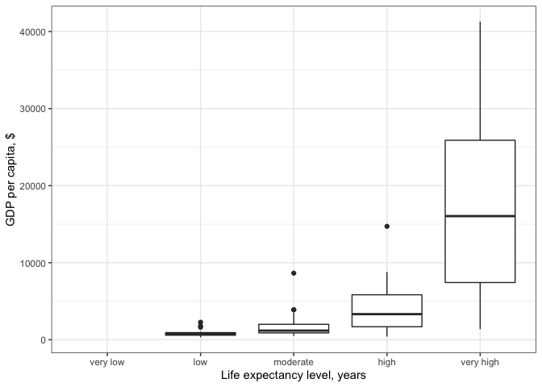
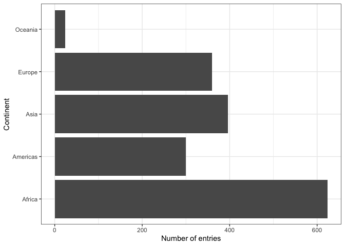

```
## ── Attaching packages ─────────────────────────────────────────────────────────── tidyverse 1.2.1 ──
```

```
## ✔ ggplot2 3.2.1     ✔ purrr   0.3.2
## ✔ tibble  2.1.3     ✔ dplyr   0.8.3
## ✔ tidyr   1.0.0     ✔ stringr 1.4.0
## ✔ readr   1.3.1     ✔ forcats 0.4.0
```

```
## ── Conflicts ────────────────────────────────────────────────────────────── tidyverse_conflicts() ──
## ✖ dplyr::filter() masks stats::filter()
## ✖ dplyr::lag()    masks stats::lag()
```

## Motivating the need for factors in R

### Activity 1: Using Factors for plotting 

**1.1** Let's look again into `gapminder` dataset and create a new cloumn, `life_level`, that contains five categories ("very high", "high","moderate", "low" and "very low") based on life expectancy in 1997. Assign categories accoring to the table below:

| Criteria | life_level| 
|-------------|-----------|
| less than 23 | very low |
| between 23 and 48 | low |
| between 48 and 59 | moderate |
| between 59 and 70 | high |
| more than 70 | very high |

Function `case_when()` is a tidier way to vectorise multiple `if_else()` statements. you can read more about this function [here](https://dplyr.tidyverse.org/reference/case_when.html).


```r
gapminder %>% 
  filter(year == 1997) %>% 
  mutate(life_level = case_when(lifeExp < 23 ~ 'very low',
                                lifeExp < 48 ~ 'low',
                                lifeExp < 59 ~ 'moderate',
                                lifeExp < 70 ~ 'high',
                                TRUE ~ 'very high')) %>% 
  ggplot() + geom_boxplot(aes(x = life_level, y = gdpPercap)) +
  labs(y = "GDP per capita, $", x= "Life expectancy level, years") +
  theme_bw() 
```

<!-- -->

Do you notice anything odd/wrong about the graph?

We can make a few observations:

- It seems that none of the countries had a "very low" life-expectancy in 1997. 

- However, since it was an option in our analysis it should be included in our plot. Right?

- Notice also how levels on x-axis are placed in the "wrong" order.

**1.2** You can correct these issues by explicitly setting the levels parameter in the call to `factor()`. Use, `drop = FALSE` to tell the plot not to drop unused levels 

```r
gapminder %>% 
  filter(year == 1997) %>% 
  mutate(life_level = factor(case_when(lifeExp < 23 ~ 'very low',
                                lifeExp < 48 ~ 'low',
                                lifeExp < 59 ~ 'moderate',
                                lifeExp < 70 ~ 'high',
                                TRUE ~ 'very high'),
                             levels = c("very low", "low", "moderate", "high", "very high"))) %>% 
  ggplot() + geom_boxplot(aes(x = life_level, y = gdpPercap)) +
  labs(y = "GDP per capita, $", x= "Life expectancy level, years") +
  theme_bw()  + 
  scale_x_discrete(drop=FALSE) #makes that the value we dont have info shows in the graph
```

<!-- -->

## Inspecting factors (activity 2)

In Activity 1, we created our own factors, so now let's explore what categorical variables that we have in the `gapminder` dataset.

### Exploring `gapminder$continent` (activity 2.1)

Use functions such as `str()`, `levels()`, `nlevels()` and `class()` to answer the following questions:

- what class is  `continent`(a factor or charecter)?

```r
gapminder$continent %>% 
class()
```

```
## [1] "factor"
```

- How many levels? 

```r
gapminder$continent %>% 
  levels()
```

```
## [1] "Africa"   "Americas" "Asia"     "Europe"   "Oceania"
```

- What are they?

```r
gapminder$continent %>% 
  levels()
```

```
## [1] "Africa"   "Americas" "Asia"     "Europe"   "Oceania"
```

- What integer is used to represent factor "Asia"?

```r
gapminder$continent %>% 
  str()
```

```
##  Factor w/ 5 levels "Africa","Americas",..: 3 3 3 3 3 3 3 3 3 3 ...
```


### Exploring `gapminder$country` (activity 2.2)

Let's explore what else we can do with factors:

Answer the following questions: 

- How many levels are there in `country`?

```r
gapminder$country %>%
  nlevels()
```

```
## [1] 142
```

- Filter `gapminder` dataset by 5 countries of your choice. How many levels are in your filtered dataset?


```r
gapminder$country %>%
  nlevels()
```

```
## [1] 142
```

```r
h_countries = c("Chile", "Argentina", "Peru", "Uruguay", "Brazil")

gapminder %>%
  filter(country %in% h_countries)
```

```
## # A tibble: 60 x 6
##    country   continent  year lifeExp      pop gdpPercap
##    <fct>     <fct>     <int>   <dbl>    <int>     <dbl>
##  1 Argentina Americas   1952    62.5 17876956     5911.
##  2 Argentina Americas   1957    64.4 19610538     6857.
##  3 Argentina Americas   1962    65.1 21283783     7133.
##  4 Argentina Americas   1967    65.6 22934225     8053.
##  5 Argentina Americas   1972    67.1 24779799     9443.
##  6 Argentina Americas   1977    68.5 26983828    10079.
##  7 Argentina Americas   1982    69.9 29341374     8998.
##  8 Argentina Americas   1987    70.8 31620918     9140.
##  9 Argentina Americas   1992    71.9 33958947     9308.
## 10 Argentina Americas   1997    73.3 36203463    10967.
## # … with 50 more rows
```

```r
gap= gapminder 
gap$country %>%
  nlevels()
```

```
## [1] 142
```

## Dropping unused levels

What if we want to get rid of some levels that are "unused" - how do we do that? 

The function `droplevels()` operates on all the factors in a data frame or on a single factor. The function `forcats::fct_drop()` operates on a factor.


```r
h_gap_dropped <- gap %>% 
  droplevels()

h_gap_dropped$country %>%
  nlevels()
```

```
## [1] 142
```

## Changing the order of levels

Let's say we wanted to re-order the levels of a factor using a new metric - say, count().

We should first produce a frequency table as a tibble using `dplyr::count()`:


The table is nice, but it would be better to visualize the data.
Factors are most useful/helpful when plotting data.
So let's first plot this:


```r
gapminder %>%
  ggplot() +
  geom_bar(aes(continent)) +
  coord_flip()+
  theme_bw() +
  ylab("Number of entries") + xlab("Continent")
```

<!-- -->

Think about how levels are normally ordered. 
It turns out that by default, R always sorts levels in alphabetical order. 
However, it is preferable to order the levels according to some principle:

  1. Frequency/count. 
  
- Make the most common level the first and so on. Function `fct_infreq()` might be useful.
- The function `fct_rev()` will sort them in the opposite order.

For instance ,
    `  

```r
gapminder %>%
  ggplot() +
  geom_bar(aes(fct_infreq(continent))) +
  coord_flip()+
  theme_bw() +
  ylab("Number of entries") + xlab("Continent")
```

<!-- -->

Section 9.6 of Jenny Bryan's [notes](https://stat545.com/factors-boss.html#reorder-factors) has some helpful examples.

  2. Another variable. 
  
  - For example, if we wanted to bring back our example of ordering `gapminder` countries by life expectancy, we can visualize the results using `fct_reorder()`. 


```r
##  default summarizing function is median()
gapminder %>%
  ggplot() +
  geom_bar(aes(fct_reorder(continent, lifeExp, max))) + # default median, but you can state to be order by min max
  coord_flip()+
  theme_bw() +
  ylab("Number of entries") + xlab("Continent")
```

<!-- -->

Use `fct_reorder2()` when you have a line chart of a quantitative x against another quantitative y and your factor provides the color. 


```r
## order by life expectancy 
ggplot(gap, aes(x = year, y = lifeExp,
                  color = continent)) +
  geom_line() +
  labs(color = "country")
```

<!-- -->

## Change order of the levels manually

This might be useful if you are preparing a report for say, the state of affairs in Oceania


```r
gapminder %>%
  ggplot() +
  geom_bar(aes(fct_relevel(continent, "Oceania", "Asia"))) + 
  coord_flip()+
  theme_bw() +
  ylab("Number of entries") + xlab("Continent")
```

<!-- -->
More details on reordering factor levels by hand can be found [here] https://forcats.tidyverse.org/reference/fct_relevel.html

### Recoding factors

Sometimes you want to specify what the levels of a factor should be.
For instance, if you had levels called "blk" and "brwn", you would rather they be called "Black" and "Brown" - this is called recoding.
Lets recode `Oceania` and the `Americas` in the graph above as abbreviations `OCN` and `AME` respectively using the function `fct_recode()`.


```r
gapminder %>%
  ggplot() +
  geom_bar(aes(fct_recode(continent, "OCN"="Oceania", "AME"="Americas"))) + 
  coord_flip()+
  theme_bw() +
  ylab("Number of entries") + xlab("Continent")
```

<!-- -->

## Grow a factor (OPTIONAL)

Let’s create two data frames,`df1` and `df2` each with data from two countries, dropping unused factor levels.


The country factors in df1 and df2 have different levels.
Can we just combine them?


The country factors in `df1` and `df2` have different levels.
Can you just combine them using `c()`?


Explore how different forms of row binding work behave here, in terms of the country variable in the result.

