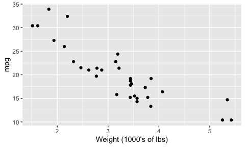
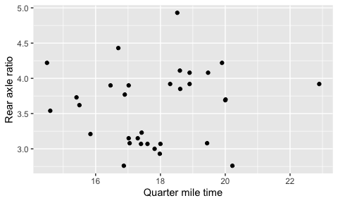

```r
suppressPackageStartupMessages(library(tidyverse))
library(gapminder)
library(tidyverse)
library(broom)
```
So you want to fit a model to your data. How can you achieve this with R?
Topics:
1. What _is_ model-fitting?
2. How do we fit a model in R?
3. How can we obtain tidy results from the model output?
## What is Model-Fitting?
When variables are not independent, then we can gain information about one variable if we know something about the other.
Examples: Use the scatterplot below:
1. A car weighs 4000 lbs. What can we say about its mpg?
2. A car weights less than 3000 lbs. What can we say about its mpg?

```r
library(tidyverse)
ggplot(mtcars, aes(wt, mpg)) +
  geom_point() +
  labs(x = "Weight (1000's of lbs)")
```

<!-- -->
Example: What can we say about rear axle ratio if we know something about quarter mile time?

```r
ggplot(mtcars, aes(qsec, drat)) + 
  geom_point() +
  labs(x = "Quarter mile time",
       y = "Rear axle ratio")
```

<!-- -->


If EDA isn't enough, we can answer these questions by fitting a model: a curve that predicts Y given X. Aka, a __regression curve__ or a __machine learning model__. 
(There are more comprehensive models too, such as modelling entire distributions, but that's not what we're doing here)
There are typically two goals of fitting a model:
1. Make predictions.
2. Interpret variable relationships.
## Fitting a model in R
Model fitting methods tend to use a common format in R:

```
method(formula, data, options)
```

They also tend to have a common output: a special _list_. 
__Method__:
A function such as:
- Linear Regression: `lm`
- Generalized Linear Regression: `glm`
- Local regression: `loess`
- Quantile regression: `quantreg::rq`
- ...
__Formula__:
In R, takes the form `y ~ x1 + x2 + ... + xp` (use column names in your data frame).
__Data__: The data frame.
__Options__: Specific to the method.
Exercise:
1. Fit a linear regression model to life expectancy ("Y") from year ("X") by filling in the formula. Notice what appears as the output.
2. On a new line, use the `unclass` function to uncover the object's true nature: a list. Note: it might be easier to use the `names` function to see what components are included in the list. 
First, create a subset of the `gapminder` dataset containing only the country of `France

```r
gapminder_France <- gapminder %>% filter(country == "France")
```


Now, using the `lm()` function we will create the linear model

```r
(my_lm <- lm(lifeExp ~ year, gapminder_France))
```

```
## 
## Call:
## lm(formula = lifeExp ~ year, data = gapminder_France)
## 
## Coefficients:
## (Intercept)         year  
##   -397.7646       0.2385
```


Does that mean that the life expectency at "year 0" was equal to -397.7646?!
We are interested in the modeling results around the modeling period which starts at year 1952. To get a meaniningful "interpretable" intercept we can use the `I()` function.

```r
(my_lm <- lm(lifeExp ~ I(year-1952), gapminder_France))
```

```
## 
## Call:
## lm(formula = lifeExp ~ I(year - 1952), data = gapminder_France)
## 
## Coefficients:
##    (Intercept)  I(year - 1952)  
##        67.7901          0.2385
```


Use the `unclass()` function to take a look at how the `lm()` object actually looks like.

```r
unclass(my_lm)
```

```
## $coefficients
##    (Intercept) I(year - 1952) 
##     67.7901282      0.2385014 
## 
## $residuals
##           1           2           3           4           5           6 
## -0.38012821 -0.05263520  0.33485781  0.18235082 -0.18015618  0.07733683 
##           7           8           9          10          11          12 
## -0.05517016  0.20232284  0.12981585  0.11730886 -0.12519814 -0.25070513 
## 
## $effects
##    (Intercept) I(year - 1952)                                              
##  -257.55220231    14.26030956     0.41516662     0.26479522    -0.09557618 
##                                                                            
##     0.16405242     0.03368103     0.29330963     0.22293823     0.21256684 
##                               
##    -0.02780456    -0.15117596 
## 
## $rank
## [1] 2
## 
## $fitted.values
##        1        2        3        4        5        6        7        8 
## 67.79013 68.98264 70.17514 71.36765 72.56016 73.75266 74.94517 76.13768 
##        9       10       11       12 
## 77.33018 78.52269 79.71520 80.90771 
## 
## $assign
## [1] 0 1
## 
## $qr
## $qr
##    (Intercept) I(year - 1952)
## 1   -3.4641016   -95.26279442
## 2    0.2886751    59.79130372
## 3    0.2886751     0.18965544
## 4    0.2886751     0.10603124
## 5    0.2886751     0.02240704
## 6    0.2886751    -0.06121716
## 7    0.2886751    -0.14484136
## 8    0.2886751    -0.22846557
## 9    0.2886751    -0.31208977
## 10   0.2886751    -0.39571397
## 11   0.2886751    -0.47933817
## 12   0.2886751    -0.56296237
## attr(,"assign")
## [1] 0 1
## 
## $qraux
## [1] 1.288675 1.273280
## 
## $pivot
## [1] 1 2
## 
## $tol
## [1] 1e-07
## 
## $rank
## [1] 2
## 
## attr(,"class")
## [1] "qr"
## 
## $df.residual
## [1] 10
## 
## $xlevels
## named list()
## 
## $call
## lm(formula = lifeExp ~ I(year - 1952), data = gapminder_France)
## 
## $terms
## lifeExp ~ I(year - 1952)
## attr(,"variables")
## list(lifeExp, I(year - 1952))
## attr(,"factors")
##                I(year - 1952)
## lifeExp                     0
## I(year - 1952)              1
## attr(,"term.labels")
## [1] "I(year - 1952)"
## attr(,"order")
## [1] 1
## attr(,"intercept")
## [1] 1
## attr(,"response")
## [1] 1
## attr(,".Environment")
## <environment: R_GlobalEnv>
## attr(,"predvars")
## list(lifeExp, I(year - 1952))
## attr(,"dataClasses")
##        lifeExp I(year - 1952) 
##      "numeric"      "numeric" 
## 
## $model
##    lifeExp I(year - 1952)
## 1   67.410              0
## 2   68.930              5
## 3   70.510             10
## 4   71.550             15
## 5   72.380             20
## 6   73.830             25
## 7   74.890             30
## 8   76.340             35
## 9   77.460             40
## 10  78.640             45
## 11  79.590             50
## 12  80.657             55
```
To complicate things further, some info is stored in _another_ list after applying the `summary` function:

```r
summary(my_lm)
```

```
## 
## Call:
## lm(formula = lifeExp ~ I(year - 1952), data = gapminder_France)
## 
## Residuals:
##      Min       1Q   Median       3Q      Max 
## -0.38013 -0.13894  0.01235  0.14295  0.33486 
## 
## Coefficients:
##                Estimate Std. Error t value Pr(>|t|)    
## (Intercept)    67.79013    0.11949  567.33  < 2e-16 ***
## I(year - 1952)  0.23850    0.00368   64.81 1.86e-14 ***
## ---
## Signif. codes:  0 '***' 0.001 '**' 0.01 '*' 0.05 '.' 0.1 ' ' 1
## 
## Residual standard error: 0.22 on 10 degrees of freedom
## Multiple R-squared:  0.9976,	Adjusted R-squared:  0.9974 
## F-statistic:  4200 on 1 and 10 DF,  p-value: 1.863e-14
```


```r
sim1_res <- augment(my_lm)
sim1_res
```

```
## # A tibble: 12 x 9
##    lifeExp I.year...1952. .fitted .se.fit  .resid   .hat .sigma .cooksd
##      <dbl>       <I<dbl>>   <dbl>   <dbl>   <dbl>  <dbl>  <dbl>   <dbl>
##  1    67.4              0    67.8  0.119  -0.380  0.295   0.176 0.885  
##  2    68.9              5    69.0  0.104  -0.0526 0.225   0.231 0.0107 
##  3    70.5             10    70.2  0.0905  0.335  0.169   0.197 0.283  
##  4    71.6             15    71.4  0.0784  0.182  0.127   0.223 0.0572 
##  5    72.4             20    72.6  0.0693 -0.180  0.0991  0.223 0.0409 
##  6    73.8             25    73.8  0.0642  0.0773 0.0851  0.230 0.00628
##  7    74.9             30    74.9  0.0642 -0.0552 0.0851  0.231 0.00319
##  8    76.3             35    76.1  0.0693  0.202  0.0991  0.221 0.0516 
##  9    77.5             40    77.3  0.0784  0.130  0.127   0.227 0.0290 
## 10    78.6             45    78.5  0.0905  0.117  0.169   0.228 0.0348 
## 11    79.6             50    79.7  0.104  -0.125  0.225   0.227 0.0606 
## 12    80.7             55    80.9  0.119  -0.251  0.295   0.210 0.385  
## # … with 1 more variable: .std.resid <dbl>
```

```r
ggplot(sim1_res, aes(.resid)) + geom_freqpoly(binwidth = 0.5)
```

<!-- -->


We can use the `predict()` function to make predictions from the model (default is to use fitting/training data). Here are the predictions:

```r
gapminder_France
```

```
## # A tibble: 12 x 6
##    country continent  year lifeExp      pop gdpPercap
##    <fct>   <fct>     <int>   <dbl>    <int>     <dbl>
##  1 France  Europe     1952    67.4 42459667     7030.
##  2 France  Europe     1957    68.9 44310863     8663.
##  3 France  Europe     1962    70.5 47124000    10560.
##  4 France  Europe     1967    71.6 49569000    13000.
##  5 France  Europe     1972    72.4 51732000    16107.
##  6 France  Europe     1977    73.8 53165019    18293.
##  7 France  Europe     1982    74.9 54433565    20294.
##  8 France  Europe     1987    76.3 55630100    22066.
##  9 France  Europe     1992    77.5 57374179    24704.
## 10 France  Europe     1997    78.6 58623428    25890.
## 11 France  Europe     2002    79.6 59925035    28926.
## 12 France  Europe     2007    80.7 61083916    30470.
```

```r
predict(my_lm) %>% 
  head()
```

```
##        1        2        3        4        5        6 
## 67.79013 68.98264 70.17514 71.36765 72.56016 73.75266
```

Predict over a new set of values for year:

```r
gapminder_France2 <- data.frame(year = seq(2000, 2005))
predict(my_lm, newdata = gapminder_France2) %>%
  head()
```

```
##       1       2       3       4       5       6 
## 79.2382 79.4767 79.7152 79.9537 80.1922 80.4307
```


```r
plot(my_lm)
```

<!-- --><!-- --><!-- --><!-- -->


We can plot models (with one predictor/ X variable) using `ggplot2` through the `geom_smooth()` layer. Specifying `method="lm"` gives us the linear regression fit (but only visually!):

```r
ggplot(gapminder, aes(gdpPercap, lifeExp)) +
    geom_point() +
    geom_smooth(method="lm", se = T) +
    scale_x_log10()
```

<!-- -->


Lets consider another country "Zimbabwe", which has a unique behavior in the `lifeExp` and `year` relationship.

```r
gapminder_Zimbabwe <- gapminder %>% filter(country == "Zimbabwe")
gapminder_Zimbabwe %>% ggplot(aes(year, lifeExp)) + geom_point()
```

<!-- -->


Let's try fitting a linear model to this relationship

```r
ggplot(gapminder_Zimbabwe, aes(year,lifeExp)) + geom_point()+geom_smooth(method = "lm", se = F)
```

<!-- -->


Now we will try to fit a second degree polynomial and see what would that look like.

```r
ggplot(gapminder_Zimbabwe, aes(year,lifeExp)) + geom_point() + geom_smooth(method = "lm", formula = y ~ poly(I(x-1952), degree = 2))
```

<!-- -->


```r
#lm_linear <- lm(data = gapminder,formula = FILL_THIS_IN)
#lm_poly <- lm(data = gapminder,formula = y ~ poly(I(x-1952)))
```


`anova` lets you compare between different models.

```r
#anova(lm_linear,lm_poly)
```
## Regression with categorical variables

```r
(lm_cat <- lm(gdpPercap ~ I(year - 1952) + continent, data = gapminder))
```

```
## 
## Call:
## lm(formula = gdpPercap ~ I(year - 1952) + continent, data = gapminder)
## 
## Coefficients:
##       (Intercept)     I(year - 1952)  continentAmericas  
##           -1375.3              129.8             4942.4  
##     continentAsia    continentEurope   continentOceania  
##            5708.4            12275.7            16427.9
```
How did R know that continent was a categorical variable?

```r
class(gapminder$continent)
```

```
## [1] "factor"
```

```r
levels(gapminder$continent)
```

```
## [1] "Africa"   "Americas" "Asia"     "Europe"   "Oceania"
```

```r
contrasts(gapminder$continent)
```

```
##          Americas Asia Europe Oceania
## Africa          0    0      0       0
## Americas        1    0      0       0
## Asia            0    1      0       0
## Europe          0    0      1       0
## Oceania         0    0      0       1
```
How can we change the reference level?

```r
gapminder$continent <- relevel(gapminder$continent, ref = "Oceania")
```
Let's build a new model

```r
lm_cat2 <- lm(gdpPercap ~ I(year - 1952) + continent, data = gapminder)
```
## Broom
Let's make it easier to extract info, using the `broom` package. There are three crown functions in this package, all of which input a fitted model, and outputs a tidy data frame.
1. `tidy`: extract statistical summaries about each component of the model.
- Useful for _interpretation_ task.
2. `augment`: add columns to the original data frame, giving information corresponding to each row.
- Useful for _prediction_ task.
3. `glance`: extract statistical summaries about the model as a whole (1-row tibble).
- Useful for checking goodness of fit.
Exercise: apply all three functions to our fitted model, `my_lm`. What do you see?

